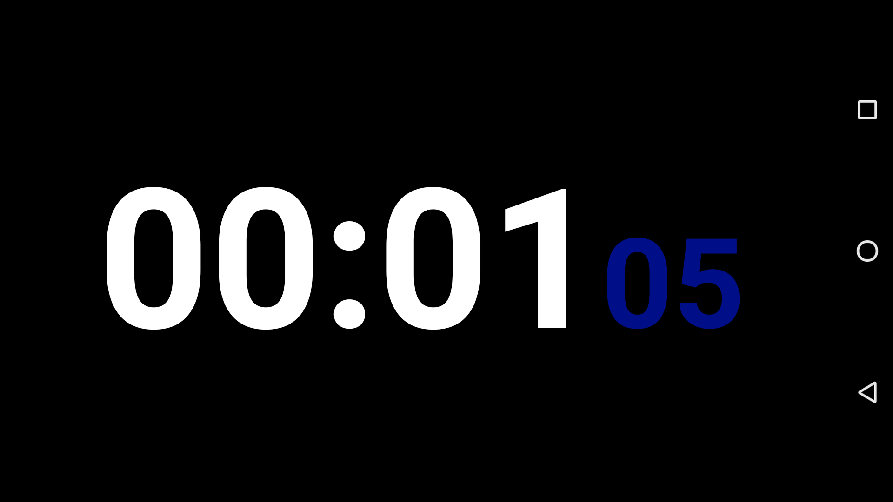

# android_hugetimer
Fullscreen timer android app with HH:MM:SS display, pause- and reset-function. 
Wanted it for a timelapse video and thought I'd share it.
Should run across all API-levels and on every Android-Version starting from 4.3 (I have it running on a Galaxy S6)

